# CivicSuite

**An open-source, sovereignly-deployable, local-LLM municipal operations suite.** Modular. Apache 2.0 / CC BY 4.0. Runs on the city's own hardware — no cloud, no telemetry, no per-seat pricing.

This `civicsuite` repository is the **umbrella / orientation repo** for the CivicSuite product family. It holds suite-wide documentation, ADRs, the roadmap, governance, and the civiccore↔module compatibility matrix. It contains no runtime code — every module lives in its own repo.

## Suite status (as of 2026-04-27)

**Shipping:**

- **civicrecords-ai v1.4.0** — open-source FOIA / public records management. Repo: <https://github.com/CivicSuite/civicrecords-ai>. (Transferred to the `CivicSuite` GitHub org on 2026-04-25.)
- **civiccore v0.2.0** — shared platform package. **Shipping today:** migration runner + 2 baseline migrations (`civiccore.migrations`), shared SQLAlchemy `Base` (`civiccore.db`), and the LLM abstraction (`civiccore.llm` — providers, templates, registry, context utilities, structured output). **Future / planned extraction (placeholder packages only — directories with a docstring `__init__.py` and no implementation):** auth, RBAC, audit, ingestion, search, notifications, connectors, exemptions, onboarding, catalog, verification. Phase 2 (LLM module) just shipped. Repo: <https://github.com/CivicSuite/civiccore>.

- **civicclerk v0.1.0** — meeting/agenda/minutes runtime foundation. Ships schema, lifecycle enforcement, packet/notice checks, immutable motion/vote/action capture, citation-gated minutes drafts, public archive endpoints, prompt eval gates, connector imports, browser QA gates, and a browser-visible staff workflow foundation at `/staff`. Full database-backed workflow UI screens are still planned. Repo: <https://github.com/CivicSuite/civicclerk>.

**Planned, not started:**
- **civiczone** — zoning code and parcel-aware planner workflows. Spec drafted only.
- 20+ additional modules across the catalog. Specs are not products. If a module is not listed above with a version, it does not exist as code yet.

See the [compatibility matrix](docs/compatibility/index.md) for the canonical version pairings.

## Quick start

There is nothing to "install" from the umbrella. Pick a module and follow its repo's setup guide:

- For FOIA / public records management today, start with [civicrecords-ai](https://github.com/CivicSuite/civicrecords-ai).
- For platform / library use, start with [civiccore](https://github.com/CivicSuite/civiccore).

If you're orienting yourself for the first time, read in this order:

1. [docs/CivicSuiteUnifiedSpec.md](docs/CivicSuiteUnifiedSpec.md) — canonical suite specification and precedence rules.
2. [USER-MANUAL.md](USER-MANUAL.md) — three-part orientation manual (decision-makers, developers, architecture).
3. [CHARTER.md](CHARTER.md) — founding document.
4. [specs/01_catalog.md](specs/01_catalog.md) — the source catalog draft folded into the unified spec.
5. [docs/architecture/](docs/architecture/) — ADRs.

## Next module lane

The next planning lane is **CivicCode**, not CivicZone. The
`CivicSuite/civiccode` repo now exists as a scaffold with Milestone 0 planning
complete; no runtime code has shipped. CivicZone remains the first major Tier 2
land-use product, but the canonical spec identifies CivicCode as the Tier 1
municipal-code layer that should be planned before CivicZone runtime work
begins. See
[docs/roadmap/civiccode-next-module-plan.md](docs/roadmap/civiccode-next-module-plan.md).

## What's in this repo

```
civicsuite/
├── README.md, README.txt           ← you are here
├── USER-MANUAL.md, .txt, .pdf, .docx ← orientation manual
├── CHANGELOG.md                    ← suite-wide doc/governance changelog
├── CONTRIBUTING.md                 ← how to file bugs (with module-routing tree)
├── LICENSE (CC BY 4.0)             ← documentation license
├── LICENSE-CODE (Apache 2.0)       ← license for any code snippets
├── SECURITY.md, CODE_OF_CONDUCT.md, SUPPORT.md
├── CHARTER.md                      ← founding doc
├── CONSISTENCY.md                  ← truth-source audit table
├── specs/                          ← canonical specs (catalog, civiccore extraction, civicclerk, civiczone)
├── docs/
│   ├── index.html                  ← GitHub Pages landing
│   ├── CivicSuiteUnifiedSpec.md    ← canonical suite specification
│   ├── architecture/               ← ADRs
│   ├── catalog/                    ← module catalog
│   ├── compatibility/index.md      ← civiccore↔module pin matrix
│   ├── governance/                 ← repo standards, transfer plan
│   ├── principles/                 ← suite-wide design principles
│   ├── roadmap/                    ← release cadence and module sequence
│   ├── github-discussions-seed.md  ← seed posts for GitHub Discussions
│   └── SUPERVISOR.md               ← human-supervisor operating card
├── .github/                        ← issue + PR templates
└── scripts/verify-docs.sh          ← required-artifact + stale-string check
```

## Where related projects live

| Module | Repo | Role |
|---|---|---|
| civicrecords-ai | <https://github.com/CivicSuite/civicrecords-ai> | Module 1, shipping. Transferred to CivicSuite org on 2026-04-25. |
| civiccore | <https://github.com/CivicSuite/civiccore> | Shared platform package. Pinned by every module. |
| civicclerk | <https://github.com/CivicSuite/civicclerk> | Module 2, v0.1.0 runtime foundation released; staff workflow UI foundation available at `/staff`. |

Future module repos (`civiczone`, …) will land under `CivicSuite/` as separate repos.

## Architecture



CivicSuite governs the umbrella, ships civiccore as a shared library, and is consumed by per-product modules. Solid arrows are runtime dependencies; dotted arrows are governance/documentation.

## Architecture in one paragraph

Every module inherits the same boring stack: FastAPI on Uvicorn, PostgreSQL 17 with pgvector, Redis 7.2 (pinned below 8.0 for license reasons), Celery + Celery Beat, and Ollama serving Gemma 4 for local LLM inference. Embeddings come from `nomic-embed-text` via Ollama. The frontend is React behind nginx. The dependency rule is one-way: modules depend on civiccore; civiccore never depends on a module. Cities run everything on their own hardware. No cloud, no telemetry, no per-seat pricing.

## Licensing

- **Documentation:** CC BY 4.0 (this `LICENSE`).
- **Code snippets** in this repo (if any): Apache License 2.0 (see `LICENSE-CODE`).
- Each module repo has its own LICENSE — most are Apache 2.0 for code and CC BY 4.0 for docs.

## Contributing

See [CONTRIBUTING.md](CONTRIBUTING.md) for the bug-routing decision tree (most bugs belong on a module repo, not here) and how to propose documentation changes. By participating, you agree to the [Code of Conduct](CODE_OF_CONDUCT.md).

## Support

See [SUPPORT.md](SUPPORT.md) for where to ask questions based on what kind of question you have. See [SECURITY.md](SECURITY.md) for vulnerability reporting.
